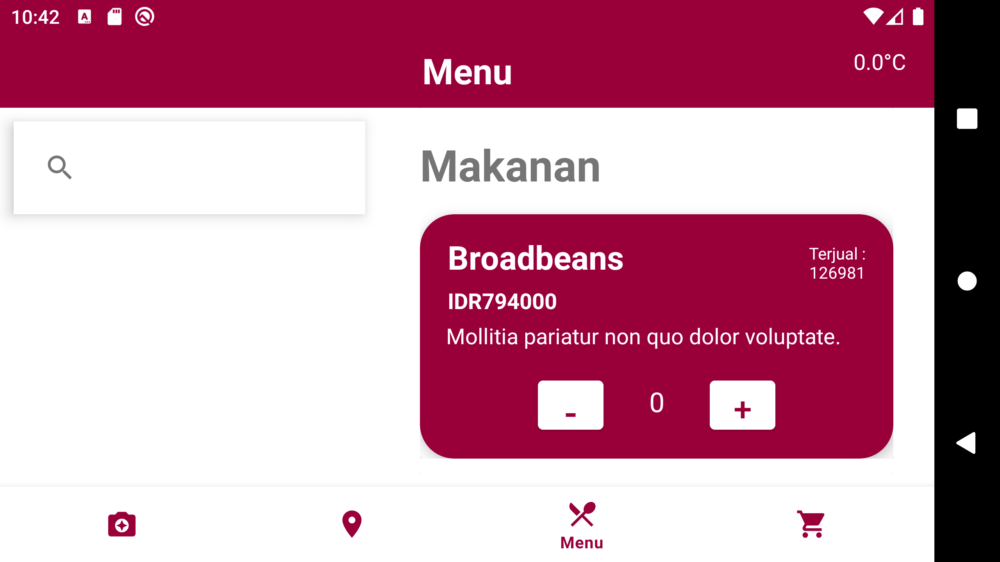

# Tugas Besar Android IF3210

## Anggota Kelompok

- 13520083 Sarah Azka Arief
- 13520085 Ubaidillah Ariq Pratama
- 13520107 Azka Syauqy Irsyad

## Deskripsi

Aplikasi ini merupakan suatu aplikasi yang dapat digunakan untuk memesan makanan dengan basis aplikasi android. Pengguna dapat melihat daftar menu yang ada pada restoran, baik makanan serta minuman, dan juga dapat menambahkannya ke dalam keranjang pembelian. Selain itu, pengguna juga dapat melihat lokasi restoran yang bersangkutan dan juga dapat mengambil foto twibbon yang telah disediakan. Untuk melakukan pembayaran, pengguna akan melakukan scan QR Code dan kemudian akan dihasilkan status pembayarannya tersebut.

## Library yang Digunakan

- Retrofit
- CodeScanner (Yuriy-Budiyev)

## Screenshots Aplikasi

- Halaman Menu

- Halaman Lokasi

- Halaman Twibbon

- Halaman Keranjang

- Halaman Pembayaran

## Pembagian Tugas

- Navbar dan Fragment: 13520107
- Halaman Menu: 13520085
- Halaman Keranjang: 13520085
- Halaman Pembayaran: 13520107
- Halaman Lokasi: 13520083
- Halaman Twibbon: 13520083
- Splash Screen: 13520107
- Wiring API: 13520083, 13520085, 13520107
- Debugging: 13520083, 13520085, 13520107

## Jam Kerja

- 13520083: 2 jam diskusi awal, 6 jam eksplorasi, 8 jam pengerjaan, 6 jam debugging
- 13520085: 2 jam diskusi awal, 6 jam eksplorasi, 8 jam pengerjaan, 6 jam debugging
- 13520107 : 2 jam diskusi awal, 6 jam eksplorasi, 8 jam pengerjaan, 6 jam debugging